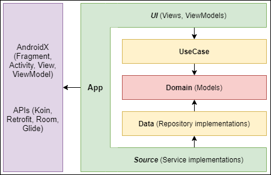

# Contacts

My interpretation of the "Clean Architecture" and best practices for a small contacts app.

Using:
- **MVVM** as the UI architecture
- **Kotlin Flows** for asynchronous UI updates
- **Jetpack Navigation Component** for navigation between views
- **Glide** for downloading and caching images from URLs
- **Kotlin Coroutines** for all asynchronous operations
- **Retrofit** for HTTP requests
- **Room** for data persistence
- **Koin** for dependency injection

Future plans:
- Migrate every layout files to **Jetpack Compose**